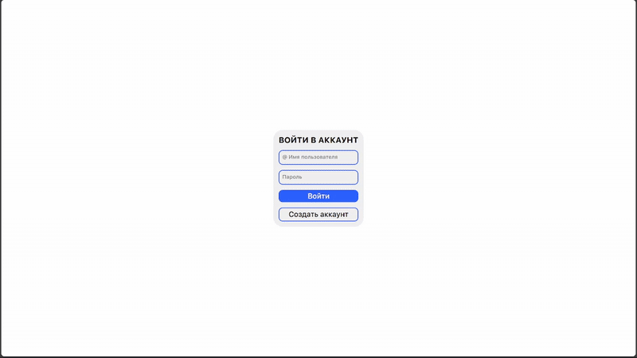
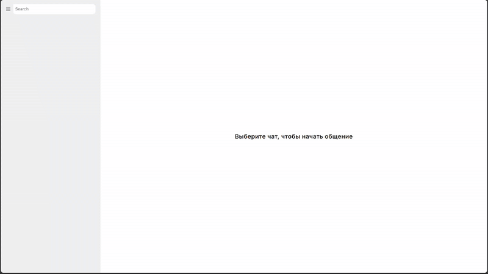
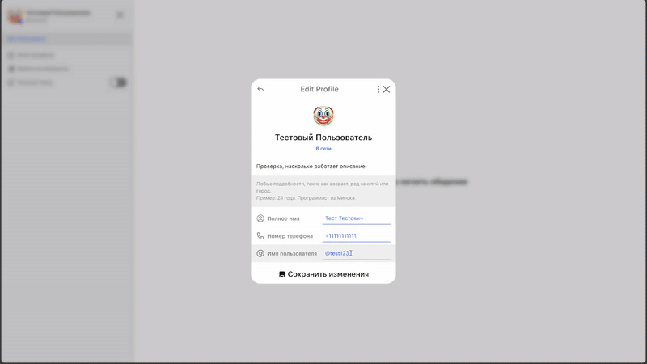
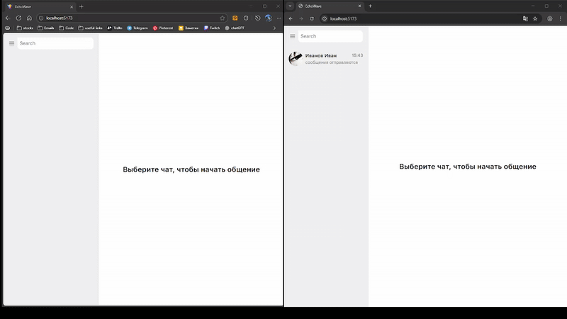
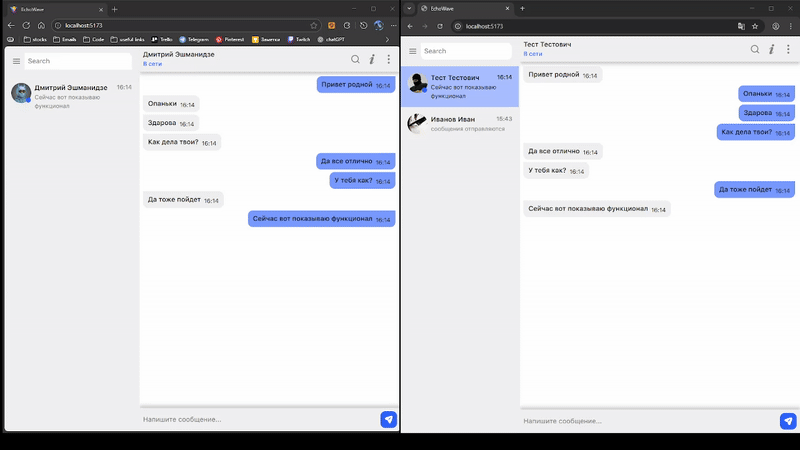
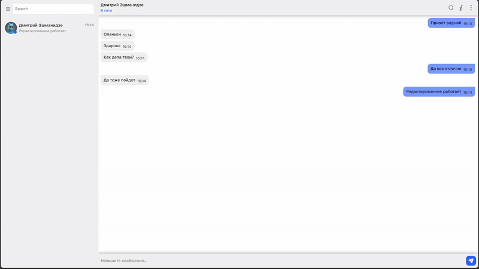

# 📡 EchoWave  


 

Современный real-time мессенджер с аутентификацией, сокетами и гибким UI.

**EchoWave** — это лёгкий и быстрый веб-мессенджер, созданный как pet-project для демонстрации навыков разработки. Приложение включает авторизацию, обмен сообщениями в реальном времени, редактирование профиля и кастомную тему интерфейса.

---

## 🚀 Технологический стек

**Frontend:**
- React + Vite  
- TypeScript  
- SCSS  
- Socket.IO-client  

**Backend:**
- Node.js  
- Express  
- Socket.IO  
- JWT  
- Multer  
- PostgreSQL

---

## ✨ Основной функционал

### 🔐 Аутентификация  
- Регистрация и вход на основе JWT  
- Защита приватных маршрутов  
- Автоматическая валидация токена при запуске приложения



### 👤 Профиль пользователя  
- Редактирование имени и описания  
- Загрузка аватара через Multer  
- Предпросмотр обновлений




### 💬 Реальные диалоги  
- Обмен сообщениями в реальном времени через Socket.IO  
- Мгновенное обновление чата  
- Статусы online/offline



### 🛠️ CRUD для сообщений  
- Создание новых сообщений  
- Изменение существующих  
- Удаление  
- Мгновенное обновление UI



### 🎨 Темы и анимации  
- Светлая и тёмная темы  
- Плавное переключение темы  
- Анимированные кнопки и переходы



### 📱 Полная адаптивность  
- Интерфейс корректно выглядит на мобильных, планшетах и больших мониторах  
- Оптимизированная верстка для маленьких экранов  
- Гибкая сетка и корректное масштабирование элементов  
- Мобильная навигация и адаптивные UI-компоненты


---

## ⚙️ Запуск проекта

```bash
# Установка зависимостей
npm install

# Запуск development-режима
npm run dev

# Сборка проекта
npm run build
```


